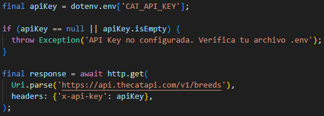
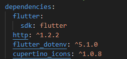
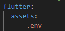
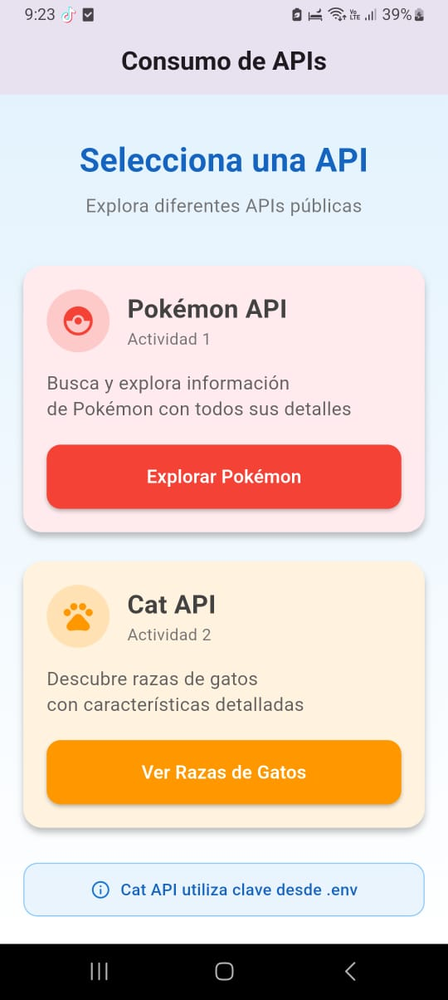

# API APK

Esta apk consume dos APIS: 
- Una API que muestra la lista de Pokemons con su imagen y sus características.
- La segunda API consume una API de razas de gatos de la siguiente página https://thecatapi.com/ que permite buscar un gato por su raza y muestra su foto y sus características.

## Pasos para la configuración

### Creación de la estructura del proyecto

Crear dos archivos:
1. cat_api.dart: Consumirá la API de gatos para mostrarlos por su raza.
2. pokemon_api.dart: Consumirá la API de pokemones y los mostrará. 
3. main.dart: Contiene un menú de opciones que permite al usuario elegir que API quiere consumir. Esta es la pantalla principal de la aplicación. 

### Configuración de la API KEY 

Para consumir la API de gatos se necesita una API Key pública que se genera con el siguiente enlace:
https://thecatapi.com/ 

#### Pasos:

## 1. Generar la API KEY
- Iniciar sesión con un correo electrónico.
- Elegir el plan gratuito

Inmediatamente llega a la bandeja de mensajes del correo con el que se inició sesión, la API Key generada. 

## Configurar la variable de entorno 

Es necesario hacer la configuración para que al momento de subir a un repositorio no se comparta ninguna API KEY. Se hace la modificación en el código cat_api.dart

En main.dart se modifica la función void run MyApp() para cargar las variables de entorno desde el .env

Además, se importa la siguiente librería: import 'package:flutter_dotenv/flutter_dotenv.dart';

Por último en el pubspec.yaml se añade lo siguiente:

Es importante añadir el archivo .env en el .gitignore para que no se suban las credenciales reales al gitHub, en su lugar se puede crear un archivo de ejemplo. (.env.example) para indicar que variables deben ser configuradas.

# Diseño de la aplicación 

## Pantalla principal

